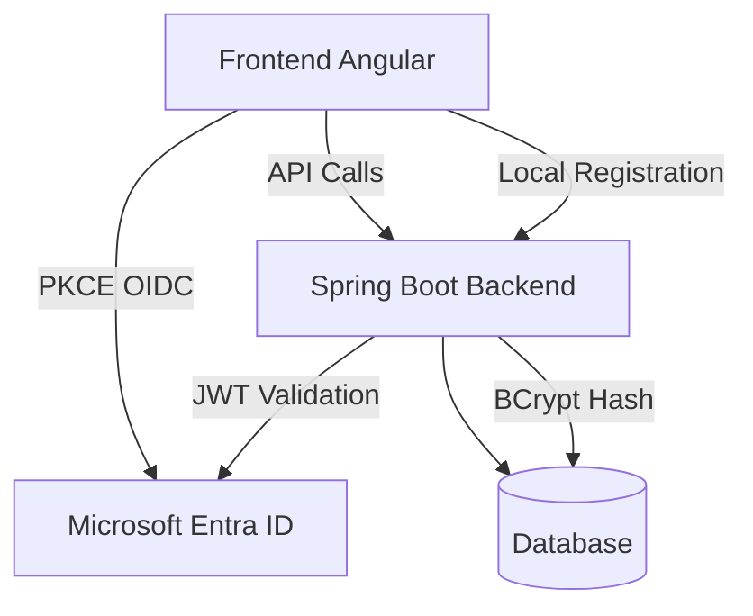

# Spring Angular Entra PoC

PoC Comptes + Microsoft Sign‑in (Angular + Spring Boot, OIDC PKCE)

## 🎯 Objectif

Ce projet démontre l'intégration d'un système d'authentification hybride combinant :

- **(A)** Création de comptes locaux via formulaire (email + password + profil minimal)
- **(B)** Connexion via Microsoft Entra ID (OpenID Connect / OIDC PKCE) côté Angular
- **(C)** Accès à des endpoints sécurisés côté Spring Boot (Resource Server JWT)

## 🏗️ Architecture



### Flux d'authentification

1. **Compte Local** : Formulaire → Hash BCrypt → Stockage DB
2. **Microsoft Entra** : PKCE Flow → JWT Token → Validation côté backend
3. **API Sécurisée** : Token JWT → Validation → Accès aux endpoints protégés

## 🚀 Quick Start

### Pré-requis

- Java 21+
- Node.js 18+
- Compte Microsoft Entra ID (Azure)

### Configuration Microsoft Entra ID

1. Créer une App Registration "spring-angular-entra-poc-SPA" (Single-page application)
2. Configurer les redirect URIs :
   - `http://localhost:4200/auth/callback`
   - `http://localhost:4200/` (logout)
3. Récupérer : Tenant ID, Client ID, Issuer URI

### Démarrage rapide

```bash
# Backend (Spring Boot)
cd backend
./mvnw spring-boot:run

# Frontend (Angular)
cd frontend
npm install
npm start
```

### URLs

- **Frontend** : http://localhost:4200
- **Backend API** : http://localhost:8080
- **Health Check** : http://localhost:8080/actuator/health

## 📚 Documentation

- [Vision & Portée](docs/vision.md)
- [Configuration Entra ID](docs/entra-setup.md)
- [Architecture](docs/architecture.md)
- [Endpoints API](docs/endpoints.md)

## 🔧 Technologies

### Backend
- **Spring Boot 3.x** (Java 21)
- **Spring Security** (OAuth2 Resource Server)
- **Spring Data JPA** (H2/PostgreSQL)
- **Bean Validation**
- **Spring Boot Actuator**

### Frontend
- **Angular 18**
- **MSAL Angular** (@azure/msal-angular)
- **TypeScript**
- **ESLint + Prettier**

### Infrastructure
- **Docker & Docker Compose**
- **GitHub Actions** (CI/CD)
- **H2 Database** (dev) / **PostgreSQL** (prod)

## 🔐 Sécurité

- **CORS** strictement configuré
- **Tokens JWT** stockés en mémoire uniquement (pas de localStorage)
- **Scopes limités** : `openid`, `profile`, `email`
- **Hash BCrypt** pour les mots de passe locaux
- **Validation** des données d'entrée

## 📋 Fonctionnalités

### ✅ Implémentées
- Structure du projet
- Documentation de base

### 🔄 En cours
- Configuration Microsoft Entra ID
- Backend Spring Boot
- Frontend Angular

### 📝 Roadmap
- Tests unitaires et e2e
- Déploiement Docker
- CI/CD GitHub Actions
- Extensions (RBAC, MFA, etc.)

## 🤝 Contribution

1. Fork le projet
2. Créer une branche feature (`git checkout -b feature/AmazingFeature`)
3. Commit vos changements (`git commit -m 'feat: add AmazingFeature'`)
4. Push vers la branche (`git push origin feature/AmazingFeature`)
5. Ouvrir une Pull Request

### Convention de commits

Nous utilisons [Conventional Commits](https://www.conventionalcommits.org/) :

- `feat:` nouvelle fonctionnalité
- `fix:` correction de bug
- `docs:` documentation
- `style:` formatage
- `refactor:` refactoring
- `test:` tests
- `chore:` maintenance

## 📄 Licence

Ce projet est sous licence MIT - voir le fichier [LICENSE](LICENSE) pour plus de détails.

## 👥 Équipe

- **Organisation** : [BrotherhoodLabs](https://github.com/BrotherhoodLabs/)
- **Repository** : [spring-angular-entra-poc](https://github.com/BrotherhoodLabs/spring-angular-entra-poc)
