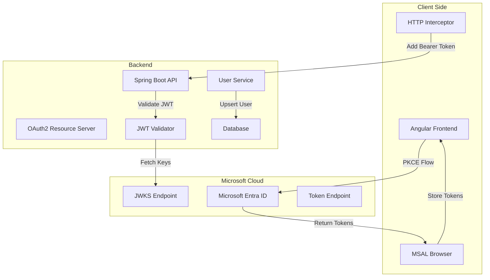
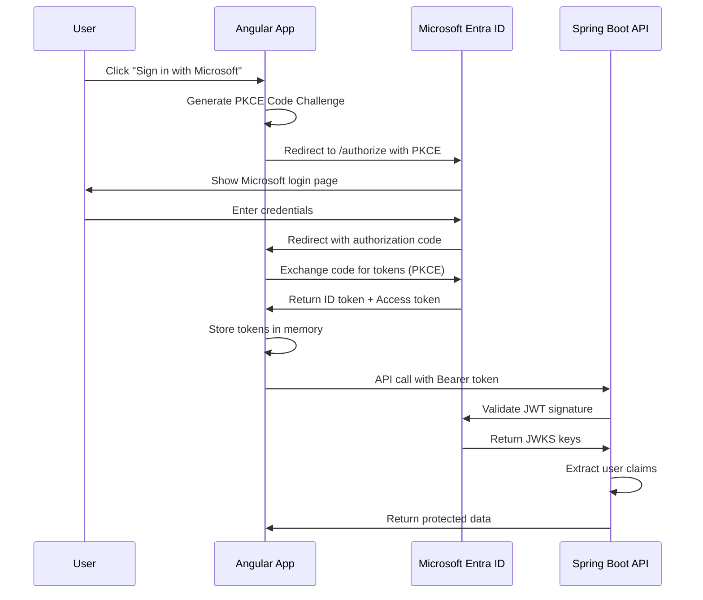
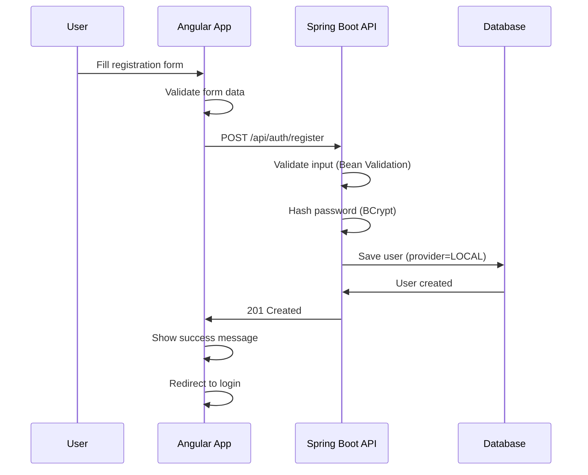

# Architecture - Spring Angular Entra PoC

## 🏗️ Vue d'Ensemble

Ce document décrit l'architecture technique du PoC Spring Angular Entra, incluant les flux d'authentification, les composants et leurs interactions.

## 📊 Diagramme d'Architecture



## 🔐 Flux d'Authentification

### 1. Authentification Microsoft Entra ID (OIDC PKCE)



### 2. Création de Compte Local



## 🧩 Composants Techniques

### Frontend (Angular)

#### MSAL Configuration
```typescript
const msalConfig = {
  auth: {
    clientId: 'your-client-id',
    authority: 'https://login.microsoftonline.com/your-tenant-id',
    redirectUri: 'http://localhost:4200/auth/callback',
    postLogoutRedirectUri: 'http://localhost:4200/'
  },
  cache: {
    cacheLocation: 'memory', // Pas de localStorage
    storeAuthStateInCookie: false
  }
};
```

#### Services Principaux
- **AuthService** : Gestion de l'authentification MSAL
- **HttpInterceptor** : Ajout automatique du Bearer token
- **RouteGuard** : Protection des routes sensibles

#### Pages et Routing
```
/ (Home)
├── /register (Création compte local)
├── /auth/callback (Callback Microsoft)
├── /profile (Profil utilisateur) - Protégé
└── /secure (Données sécurisées) - Protégé
```

### Backend (Spring Boot)

#### Configuration OAuth2 Resource Server
```yaml
spring:
  security:
    oauth2:
      resourceserver:
        jwt:
          issuer-uri: https://login.microsoftonline.com/{tenantId}/v2.0
```

#### Modèle de Données
```java
@Entity
public class User {
    @Id
    private UUID id;
    @Column(unique = true)
    private String email;
    private String passwordHash; // Null pour Microsoft
    private String displayName;
    @Enumerated(EnumType.STRING)
    private Provider provider; // LOCAL | MICROSOFT
    private LocalDateTime createdAt;
}
```

#### Endpoints API
```
POST /api/auth/register (Public)
POST /api/auth/login (Public, optionnel)
GET  /api/me (Protégé)
GET  /api/secure-data (Protégé)
GET  /actuator/health (Public)
```

#### Sécurité
- **CORS** : Origin `http://localhost:4200`
- **JWT Validation** : Via JWKS Microsoft
- **Password Hashing** : BCrypt avec salt
- **Input Validation** : Bean Validation

## 🔄 Flux de Données

### 1. Authentification Microsoft
1. **Initiation** : User clique sur "Sign in with Microsoft"
2. **PKCE Challenge** : Angular génère code_challenge
3. **Authorization** : Redirection vers Microsoft avec PKCE
4. **Authentication** : User s'authentifie chez Microsoft
5. **Callback** : Microsoft redirige avec authorization_code
6. **Token Exchange** : Angular échange le code contre les tokens
7. **Storage** : Tokens stockés en mémoire uniquement
8. **API Calls** : Bearer token ajouté automatiquement

### 2. Gestion des Utilisateurs
1. **Premier appel API** : User avec token Microsoft appelle `/api/me`
2. **JWT Validation** : Spring valide le token via JWKS
3. **User Extraction** : Extraction des claims (sub, email, name)
4. **User Upsert** : Création ou mise à jour du User en base
5. **Response** : Retour des données utilisateur

### 3. Comptes Locaux
1. **Registration** : Formulaire Angular vers `/api/auth/register`
2. **Validation** : Bean Validation côté Spring
3. **Password Hashing** : BCrypt avec salt
4. **Persistence** : Sauvegarde en base avec provider=LOCAL
5. **Response** : Confirmation de création

## 🛡️ Sécurité

### Authentification
- **OIDC PKCE** : Protection contre les attaques CSRF
- **JWT Validation** : Signature vérifiée via JWKS Microsoft
- **Token Storage** : Mémoire uniquement (pas de localStorage)
- **CORS** : Origins strictement définis

### Autorisation
- **Route Guards** : Protection côté frontend
- **SecurityFilterChain** : Protection côté backend
- **Scopes Limités** : openid, profile, email uniquement

### Validation
- **Input Validation** : Bean Validation sur tous les inputs
- **Password Policy** : Force minimum requirements
- **Email Uniqueness** : Contrainte base de données

## 📊 Persistance

### Base de Données
- **Développement** : H2 (in-memory)
- **Production** : PostgreSQL (optionnel)
- **Migrations** : Flyway ou Liquibase

### Schéma Principal
```sql
CREATE TABLE users (
    id UUID PRIMARY KEY,
    email VARCHAR(255) UNIQUE NOT NULL,
    password_hash VARCHAR(255), -- NULL pour Microsoft
    display_name VARCHAR(255) NOT NULL,
    provider VARCHAR(20) NOT NULL, -- LOCAL | MICROSOFT
    created_at TIMESTAMP NOT NULL
);
```

## 🚀 Déploiement

### Docker
```yaml
# docker-compose.yml
version: '3.8'
services:
  backend:
    build: ./backend
    ports:
      - "8080:8080"
    environment:
      - SPRING_PROFILES_ACTIVE=docker
  
  frontend:
    build: ./frontend
    ports:
      - "4200:80"
    depends_on:
      - backend
```

### Variables d'Environnement
```bash
# Backend
SPRING_SECURITY_OAUTH2_RESOURCESERVER_JWT_ISSUER_URI=https://login.microsoftonline.com/{tenantId}/v2.0
SPRING_DATASOURCE_URL=jdbc:postgresql://db:5432/spring_angular_entra
CORS_ALLOWED_ORIGINS=http://localhost:4200

# Frontend
MSAL_CLIENT_ID=your_client_id
MSAL_TENANT_ID=your_tenant_id
API_BASE_URL=http://backend:8080
```

## 📈 Observabilité

### Logging
- **Backend** : Logback avec JSON format
- **Frontend** : Console logging en dev
- **Correlation ID** : Traçabilité des requêtes

### Monitoring
- **Health Checks** : `/actuator/health`
- **Metrics** : Spring Boot Actuator
- **Error Tracking** : Logs structurés

## 🔍 Tests

### Backend
- **Unit Tests** : Services et repositories
- **Integration Tests** : Controllers avec TestContainers
- **Security Tests** : JWT validation et CORS

### Frontend
- **Unit Tests** : Services et components
- **E2E Tests** : Cypress avec mock Microsoft
- **Security Tests** : Route guards et token handling

## 📚 Technologies

### Frontend
- **Angular 18** : Framework principal
- **MSAL Angular** : Authentification Microsoft
- **RxJS** : Programmation réactive
- **Angular Material** : Composants UI

### Backend
- **Spring Boot 3.x** : Framework principal
- **Spring Security** : Sécurité et OAuth2
- **Spring Data JPA** : Persistance
- **Bean Validation** : Validation des données

### Infrastructure
- **Docker** : Containerisation
- **GitHub Actions** : CI/CD
- **H2/PostgreSQL** : Base de données
