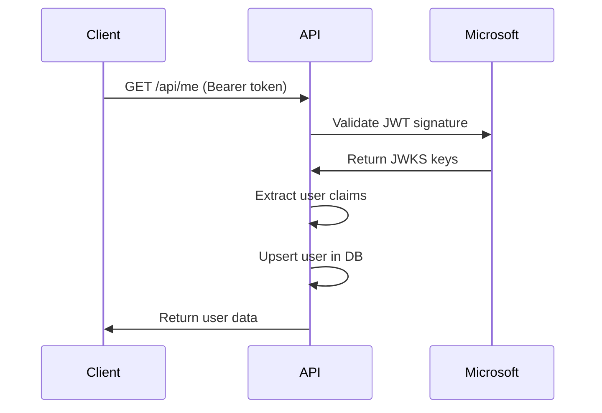
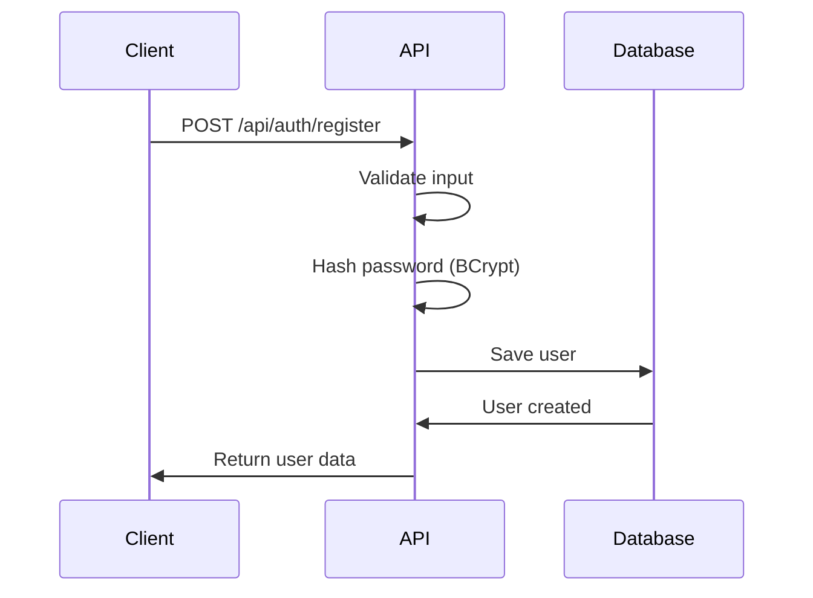

# API Endpoints - Spring Angular Entra PoC

## 📋 Vue d'Ensemble

Documentation complète des endpoints de l'API Spring Boot pour le PoC d'authentification hybride.

## 🔗 Base URL

- **Développement** : `http://localhost:8080`
- **Production** : `https://api.votre-domaine.com`

## 🔐 Authentification

### Headers Requis
```
Content-Type: application/json
Authorization: Bearer <jwt_token> (pour les endpoints protégés)
```

### Types d'Authentification
1. **Microsoft Entra ID** : JWT token de Microsoft
2. **Compte Local** : JWT token applicatif (optionnel)

## 📚 Endpoints Publics

### POST /api/auth/register

Créer un nouveau compte utilisateur local.

**Request Body:**
```json
{
  "email": "user@example.com",
  "password": "SecurePassword123!",
  "displayName": "John Doe"
}
```

**Response 201 Created:**
```json
{
  "id": "123e4567-e89b-12d3-a456-426614174000",
  "email": "user@example.com",
  "displayName": "John Doe",
  "provider": "LOCAL",
  "createdAt": "2025-01-30T10:30:00Z"
}
```

**Response 400 Bad Request:**
```json
{
  "timestamp": "2025-01-30T10:30:00Z",
  "status": 400,
  "error": "Bad Request",
  "message": "Validation failed",
  "details": [
    {
      "field": "email",
      "message": "Email must be valid"
    },
    {
      "field": "password",
      "message": "Password must be at least 8 characters"
    }
  ]
}
```

**Response 409 Conflict:**
```json
{
  "timestamp": "2025-01-30T10:30:00Z",
  "status": 409,
  "error": "Conflict",
  "message": "Email already exists"
}
```

**Validation Rules:**
- `email` : Format email valide, requis
- `password` : Minimum 8 caractères, requis
- `displayName` : Minimum 2 caractères, requis

### POST /api/auth/login (Optionnel)

Authentifier un utilisateur avec compte local.

**Request Body:**
```json
{
  "email": "user@example.com",
  "password": "SecurePassword123!"
}
```

**Response 200 OK:**
```json
{
  "token": "eyJhbGciOiJSUzI1NiIsInR5cCI6IkpXVCJ9...",
  "type": "Bearer",
  "expiresIn": 3600,
  "user": {
    "id": "123e4567-e89b-12d3-a456-426614174000",
    "email": "user@example.com",
    "displayName": "John Doe",
    "provider": "LOCAL"
  }
}
```

**Response 401 Unauthorized:**
```json
{
  "timestamp": "2025-01-30T10:30:00Z",
  "status": 401,
  "error": "Unauthorized",
  "message": "Invalid credentials"
}
```

### GET /actuator/health

Vérifier l'état de santé de l'application.

**Response 200 OK:**
```json
{
  "status": "UP",
  "components": {
    "db": {
      "status": "UP",
      "details": {
        "database": "H2",
        "validationQuery": "isValid()"
      }
    },
    "diskSpace": {
      "status": "UP",
      "details": {
        "total": 250790436864,
        "free": 100000000000,
        "threshold": 10485760,
        "exists": true
      }
    }
  }
}
```

## 🔒 Endpoints Protégés

### GET /api/me

Récupérer les informations de l'utilisateur authentifié.

**Headers:**
```
Authorization: Bearer <jwt_token>
```

**Response 200 OK:**
```json
{
  "id": "123e4567-e89b-12d3-a456-426614174000",
  "email": "user@example.com",
  "displayName": "John Doe",
  "provider": "MICROSOFT",
  "createdAt": "2025-01-30T10:30:00Z",
  "claims": {
    "sub": "microsoft_user_id",
    "tid": "tenant_id",
    "name": "John Doe",
    "preferred_username": "user@company.com"
  }
}
```

**Response 401 Unauthorized:**
```json
{
  "timestamp": "2025-01-30T10:30:00Z",
  "status": 401,
  "error": "Unauthorized",
  "message": "JWT token is invalid or expired"
}
```

**Logique:**
1. Validation du JWT token
2. Extraction des claims utilisateur
3. Upsert de l'utilisateur en base (si Microsoft)
4. Retour des informations utilisateur

### GET /api/secure-data

Accéder à des données protégées (exemple).

**Headers:**
```
Authorization: Bearer <jwt_token>
```

**Response 200 OK:**
```json
{
  "message": "This is secure data",
  "timestamp": "2025-01-30T10:30:00Z",
  "user": {
    "id": "123e4567-e89b-12d3-a456-426614174000",
    "email": "user@example.com",
    "displayName": "John Doe"
  },
  "data": {
    "secret": "This data is only accessible to authenticated users",
    "permissions": ["read"],
    "expiresAt": "2025-01-31T10:30:00Z"
  }
}
```

**Response 401 Unauthorized:**
```json
{
  "timestamp": "2025-01-30T10:30:00Z",
  "status": 401,
  "error": "Unauthorized",
  "message": "Access denied"
}
```

## 🚨 Gestion d'Erreurs

### Format Standard d'Erreur
```json
{
  "timestamp": "2025-01-30T10:30:00Z",
  "status": 400,
  "error": "Bad Request",
  "message": "Description de l'erreur",
  "path": "/api/auth/register",
  "details": [
    {
      "field": "email",
      "message": "Message d'erreur spécifique"
    }
  ]
}
```

### Codes d'Erreur HTTP

| Code | Description | Cas d'Usage |
|------|-------------|-------------|
| 200 | OK | Succès |
| 201 | Created | Ressource créée |
| 400 | Bad Request | Données invalides |
| 401 | Unauthorized | Token invalide/expiré |
| 403 | Forbidden | Permissions insuffisantes |
| 404 | Not Found | Ressource introuvable |
| 409 | Conflict | Ressource déjà existante |
| 422 | Unprocessable Entity | Validation échouée |
| 500 | Internal Server Error | Erreur serveur |

## 🔄 Flux d'Authentification

### Microsoft Entra ID Flow



### Compte Local Flow



## 📊 Modèles de Données

### User Entity
```java
public class User {
    private UUID id;
    private String email;
    private String passwordHash; // Null pour Microsoft
    private String displayName;
    private Provider provider; // LOCAL | MICROSOFT
    private LocalDateTime createdAt;
}
```

### RegisterRequest
```java
public class RegisterRequest {
    @Email
    @NotBlank
    private String email;
    
    @NotBlank
    @Size(min = 8)
    private String password;
    
    @NotBlank
    @Size(min = 2)
    private String displayName;
}
```

### LoginRequest (Optionnel)
```java
public class LoginRequest {
    @Email
    @NotBlank
    private String email;
    
    @NotBlank
    private String password;
}
```

## 🔧 Configuration CORS

```java
@Configuration
public class CorsConfig {
    @Bean
    public CorsConfigurationSource corsConfigurationSource() {
        CorsConfiguration configuration = new CorsConfiguration();
        configuration.setAllowedOriginPatterns(Arrays.asList("http://localhost:4200"));
        configuration.setAllowedMethods(Arrays.asList("GET", "POST", "PUT", "DELETE", "OPTIONS"));
        configuration.setAllowedHeaders(Arrays.asList("*"));
        configuration.setAllowCredentials(true);
        
        UrlBasedCorsConfigurationSource source = new UrlBasedCorsConfigurationSource();
        source.registerCorsConfiguration("/api/**", configuration);
        return source;
    }
}
```

## 📝 Exemples d'Utilisation

### Frontend Angular - Service HTTP

```typescript
@Injectable()
export class AuthService {
  constructor(private http: HttpClient) {}
  
  register(userData: RegisterRequest): Observable<User> {
    return this.http.post<User>('/api/auth/register', userData);
  }
  
  getMe(): Observable<User> {
    return this.http.get<User>('/api/me');
  }
  
  getSecureData(): Observable<SecureData> {
    return this.http.get<SecureData>('/api/secure-data');
  }
}
```

### Intercepteur HTTP

```typescript
@Injectable()
export class AuthInterceptor implements HttpInterceptor {
  intercept(req: HttpRequest<any>, next: HttpHandler): Observable<HttpEvent<any>> {
    const token = this.authService.getAccessToken();
    
    if (token) {
      req = req.clone({
        setHeaders: {
          Authorization: `Bearer ${token}`
        }
      });
    }
    
    return next.handle(req);
  }
}
```

## 🧪 Tests

### Tests d'Intégration

```java
@SpringBootTest
@AutoConfigureTestDatabase
class AuthControllerTest {
    
    @Test
    void register_ValidData_ReturnsUser() {
        RegisterRequest request = new RegisterRequest();
        request.setEmail("test@example.com");
        request.setPassword("password123");
        request.setDisplayName("Test User");
        
        ResponseEntity<User> response = restTemplate.postForEntity(
            "/api/auth/register", request, User.class);
        
        assertThat(response.getStatusCode()).isEqualTo(HttpStatus.CREATED);
        assertThat(response.getBody().getEmail()).isEqualTo("test@example.com");
    }
    
    @Test
    void getMe_ValidToken_ReturnsUser() {
        String token = "valid_jwt_token";
        
        HttpHeaders headers = new HttpHeaders();
        headers.setBearerAuth(token);
        
        ResponseEntity<User> response = restTemplate.exchange(
            "/api/me", HttpMethod.GET, new HttpEntity<>(headers), User.class);
        
        assertThat(response.getStatusCode()).isEqualTo(HttpStatus.OK);
    }
}
```

## 📚 Ressources

- [Spring Security OAuth2 Resource Server](https://docs.spring.io/spring-security/reference/servlet/oauth2/resource-server/index.html)
- [JWT.io](https://jwt.io/) - Débogage des tokens JWT
- [Postman Collection](api-collection.json) - Collection d'API pour tests
